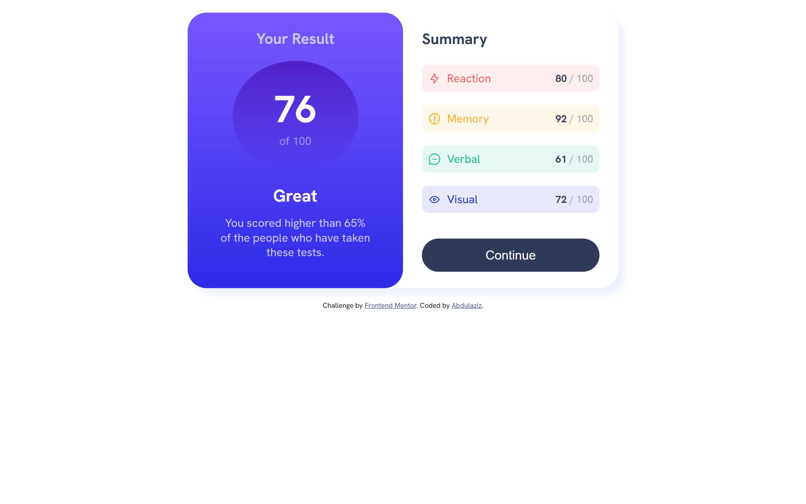
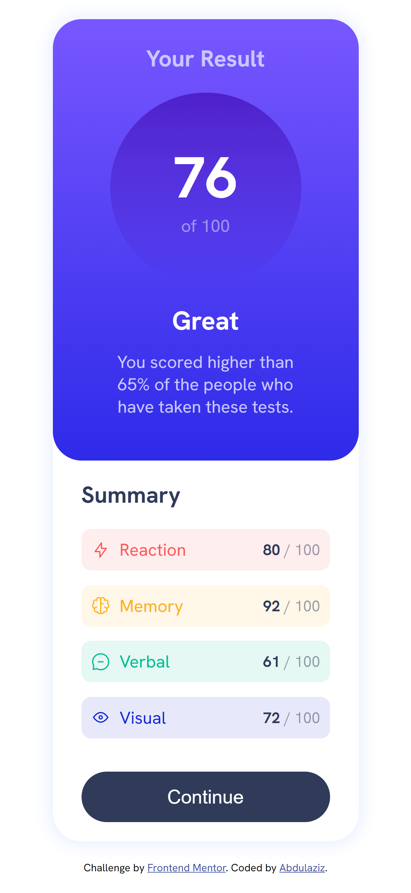

# Frontend Mentor - Results summary component solution

This is a solution to the [Results summary component challenge on Frontend Mentor](https://www.frontendmentor.io/challenges/results-summary-component-CE_K6s0maV). Frontend Mentor challenges help you improve your coding skills by building realistic projects. 

## The challenge

Users should be able to:

- View the optimal layout for the interface depending on their device's screen size
- See hover and focus states for all interactive elements on the page

### Screenshot

### Links

- Solution URL: [Frontend Mentor Solution URL](https://your-solution-url.com)
- Live Site URL: [Take a look](https://your-live-site-url.com)

### Built with

- Semantic HTML5 markup
- CSS custom properties
- Flexbox

## Author

- LinkedIn - [@abdulaziz-omran](https://www.linkedin.com/in/abdulaziz-omran/)
- Frontend Mentor - [@abdulaziz-M895](https://www.frontendmentor.io/profile/abdulaziz-M895)